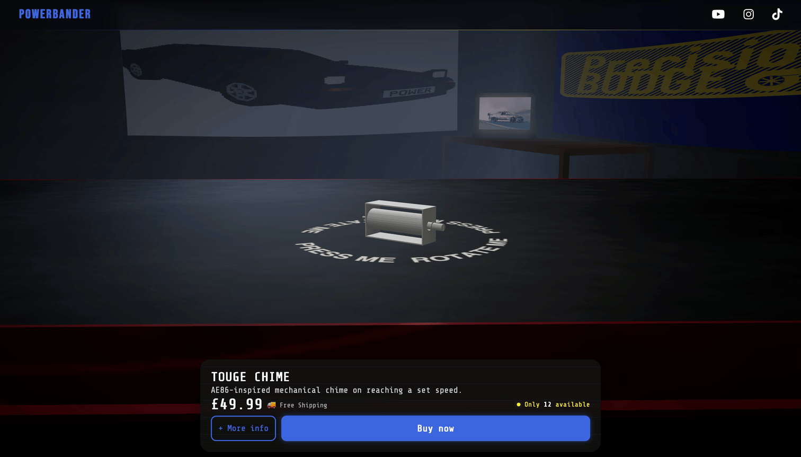
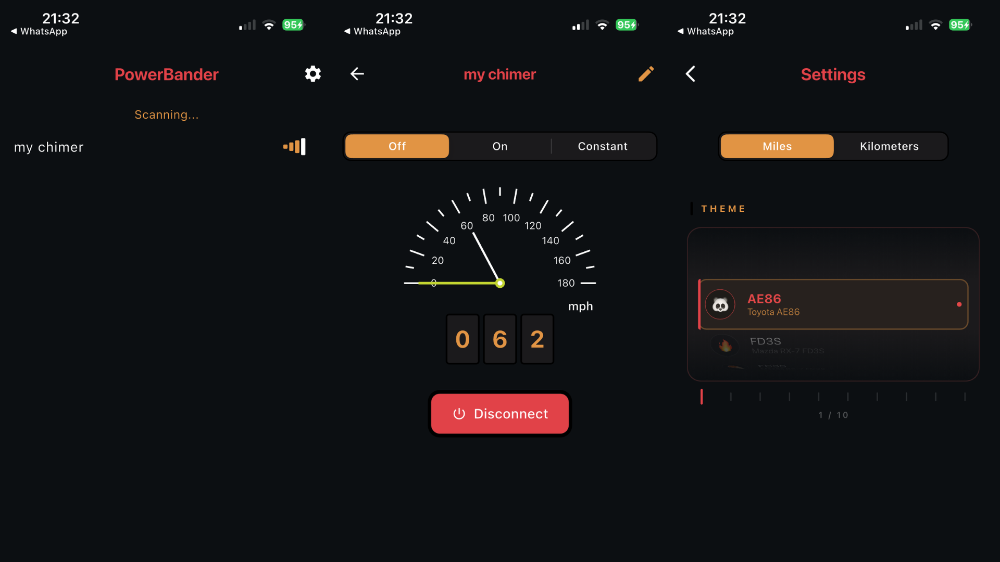
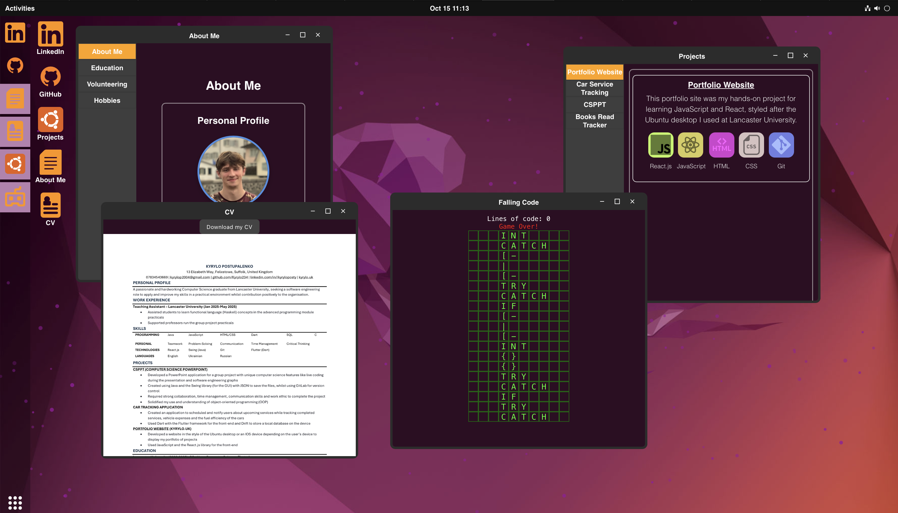
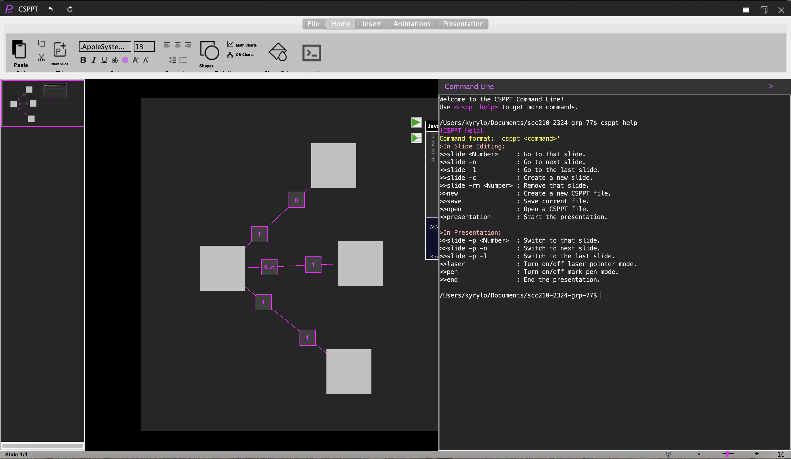

<h1 align="center">👋 Hi, I'm Kyrylo</h1>
<h3 align="center">Computer Science graduate from Lancaster University</h3>

  <a href="https://kyrylo.uk" target="_blank">🌐 Portfolio</a> |
  <a href="https://www.linkedin.com/in/kyryloposty/" target="_blank">💼 LinkedIn</a>

---

## 🧠 About Me
🚀 Passionate about **startups and innovation in Edinburgh**  

💡 Current Projects:
- **ESP32-powered mechanical chime** inspired by the Toyota AE-86 “speeding chimer”  
- **Controlled via a Flutter app** 
- **Showcased on a Three.js website** for live demo and visualization

---

## 🧩 My Favourite Projects

### 🏎️ [3D Touge Chimer Shop](https://kyrylo.uk/)
Interactive 3D shop showcasing my product, built with **Three.js** and using **Stripe** payment processing.

  

  
  
  
  
  
  
  

---

### 📱 [Touge Chimer Controller App](https://kyrylo.uk/)
An App to control the Touge Chimer device through Bluetooth, built with **Flutter**

  

  
  
  
  
  

---

### 🖥️ [React.js Portfolio Website](https://kyrylo.uk/)
Portfolio website inspired by Ubuntu Linux or an iOS device (based on your device), featuring a Falling Blocks game with persistent high scores. Built with **React.js**, **Node.js**, and **SQLite3**.

📂 [View Repo](https://github.com/Kyrylo234/Linux_portfolio_website)

  

  
  
  
  
  
  

---

### 🖼️ [Image To STL](https://github.com/Kyrylo234/image_to_stl)
Convert any image into 3D printable STL models with **Python**!

  

  
  
  
  
  

---

### 🧑‍🏫 [Computer Science PowerPoint](https://github.com/Kyrylo234/CSPPT)
A presentation tool for computer scientists with **live coding**, **UML diagrams**, and an **inbuilt terminal**, created in **Java** Swing.

  

  
  

---

## 🧠 Languages & Tools

  
  
  
  
  
  
  
  
  
  
  
  

---

## 📊 GitHub Stats

  
  

