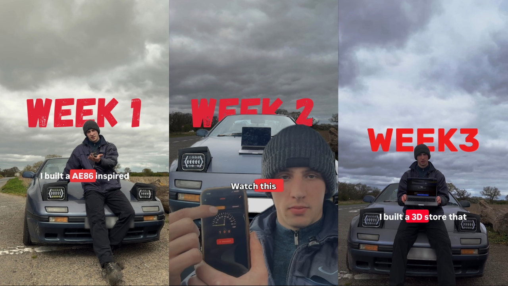
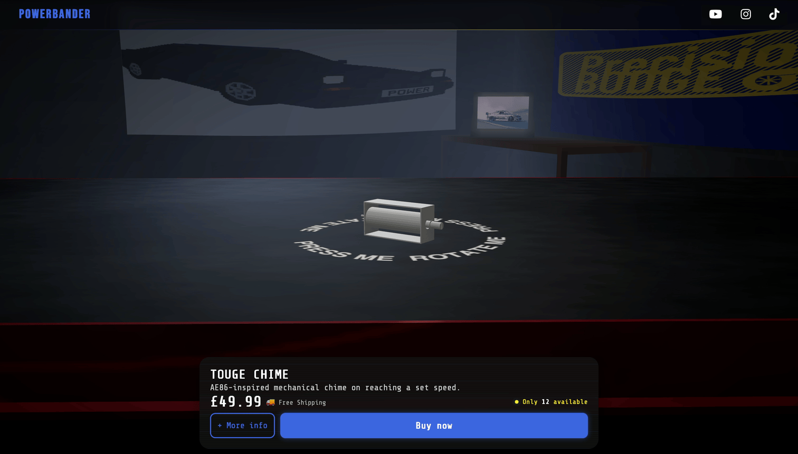
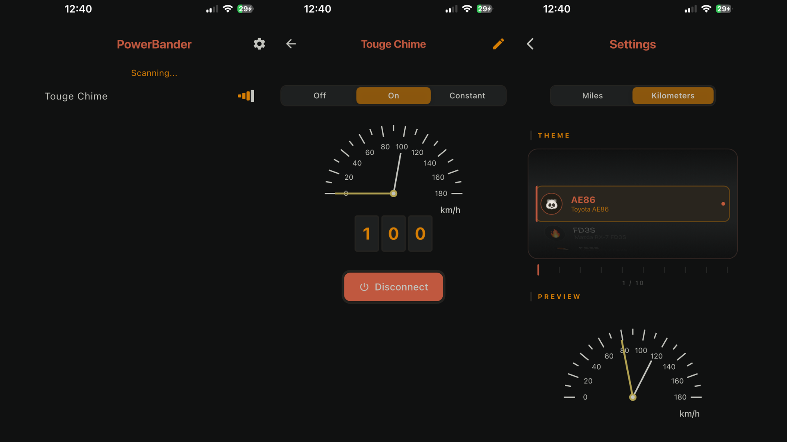
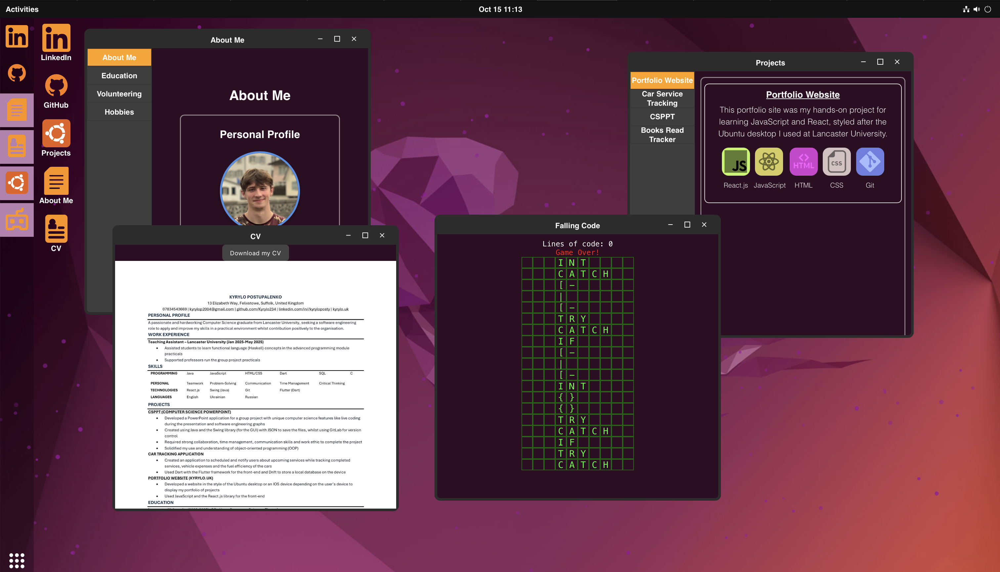
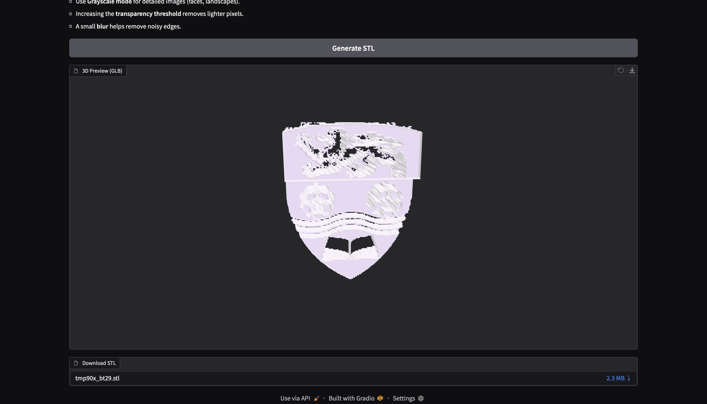

<h1 align="center">👋 Hi, I'm Kyrylo</h1>
<h3 align="center">Incoming MSc Computer Science @ St Andrews • Maker of Touge Chime • Startup Enthusiast</h3>

  <a href="https://kyrylo.uk" target="_blank">🌐 Portfolio</a> |
  <a href="https://www.linkedin.com/in/kyryloposty/" target="_blank">💼 LinkedIn</a> |
  <a href="https://www.kaggle.com/kyrylo234" target="_blank">🤖 Kaggle</a>

## 🧑‍🔧 About Me
🚀 Building **[PowerBander](https://powerbander.tech/)** - a JDM-inspired hardware brand
 🔔 Currently launching **Touge Chime**
 📬 **100 email subscribers** for batch 1
 📸 **450+ followers** on Instagram with **150k+** organic views

  
  
  

## 🧩 Favourite Projects

### 🔔 [Touge Chime](https://powerbander.tech/)
- Mechanical chime recreating the iconic Toyota AE86 "speeding chime" using an ESP32. 
- Controlled via a Bluetooth Low Energy companion app.

🔒 Private repo

  

  
  
  

 

### 🏎️ [3D Touge Chime Shop](https://powerbander.tech/)
- Interactive 3D e-commerce store, styled after a garage.
- Self-hosted on my **Raspberry Pi 4** using a **Cloudflare** tunnel.
- Built with **Next.js/Three.js**, using **Stripe** payment processing.

🔒 Private repo

  

  
  
  
  
  
  
  
  
  
  
  
  

 

### 📱 [Touge Chime Controller App](https://apps.apple.com/app/powerbander/id6762231997)
- Bluetooth LE companion app for  **Touge Chime**, built with  **Flutter**.
- Features BLE speed control, live speedometer, and 10 JDM car themes
- Available on iOS · Android coming soon

🔒 Private repo

  

  
  
  
  
  

 

### 🖥️ [Portfolio Website](https://kyrylo.uk/)
- Portfolio website inspired by Ubuntu Linux or an iOS device (based on your device), featuring a Falling Blocks game with persistent high scores. Built with **React.js**, **Node.js**, and **SQLite3**.

📂 [View Repo](https://github.com/Kyrylo234/Linux_portfolio_website)

  

  
  
  
  
  
  

 

### 🖼️ [Image To STL](https://github.com/Kyrylo234/image_to_stl)
Convert any image into 3D printable STL models with **Python**!

📂 [View Repo](https://github.com/Kyrylo234/Image_to_stl)

  

  
  
  
  
  

