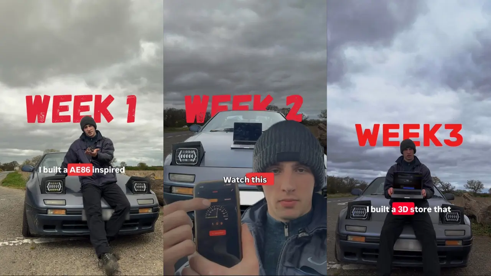
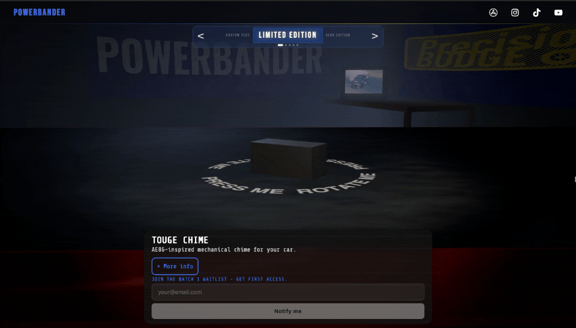
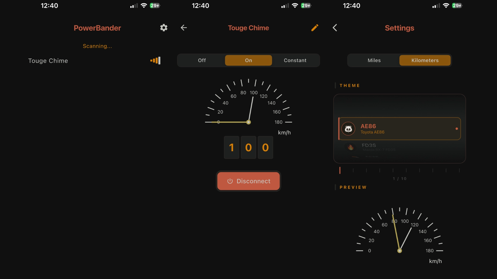
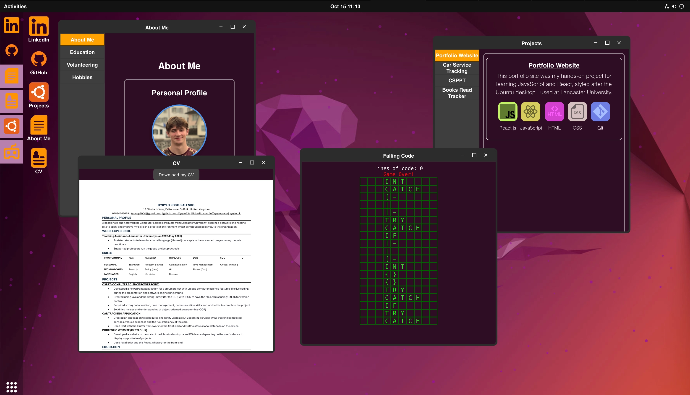
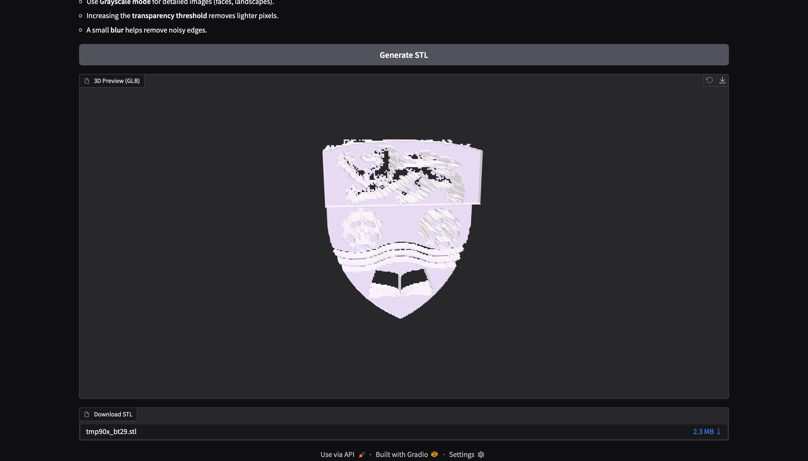
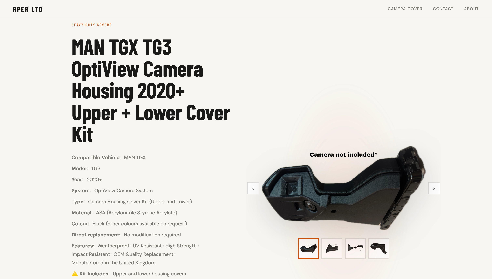

<h1 align="center">👋 Hi, I'm Kyrylo</h1>
<h3 align="center">MSc Computer Science @ St Andrews | Founder of &nbsp;</h3>

  <a href="https://kyrylo.uk" target="_blank">🌐 Portfolio</a> |
  <a href="https://www.linkedin.com/in/kyryloposty/" target="_blank">💼 LinkedIn</a> |
  <a href="https://www.kaggle.com/kyrylo234" target="_blank">🤖 Kaggle</a>

## 🧑‍🔧 About Me
- 👨‍🎓 Focusing on **Artificial Intelligence & Software Product Management**, with a strong interest in the intersection of embedded systems and machine learning.
- 🚀 Launching hardware product **[Touge Chime](https://powerbander.tech/)** — **300+ Batch 1 email sign-ups**.
- 📸 **1k+ Instagram** followers with **1M+ organic views** across platforms.
- 🛠️ CAD design, embedded C, published iOS BLE app, 3D web store, and self-hosted server infrastructure.

  
  
  

---

## ⚡ Featured Projects

### 🔔 [Touge Chime](https://powerbander.tech/)
Engineered a modern recreation of the iconic Toyota AE86 mechanical speeding chime. Documented progress on social media to build launch traction.

  

  
  
  

- **Design & Physical Prototyping:** Designed enclosure in FreeCAD; hand-soldered Batch 1 assembly. Fabricated chime plates from scratch using Audacity spectral analysis for precise frequency tuning.
- **Firmware & Embedded:** Programmed dual-core ESP32 Mini to execute real-time GPS processing, solenoid pulse control, and BLE communication simultaneously.

---

### 🏎️ [3D Touge Chime Shop](https://powerbander.tech/)
Architected an interactive, garage-themed full-stack 3D e-commerce storefront.

  

  
  
  
  
  

- **Web 3D Pipeline:** Modeled garage environment in Blender; optimized geometry and compression for minimal load times. Rendered real-time lighting and interactions with Three.js.
- **DevOps & Infrastructure:** Self-hosted on local Linux Raspberry Pi 4 behind Cloudflare Tunnels; automated builds via GitHub Actions CI/CD.

---

### 📱 [Touge Chime Controller App](https://apps.apple.com/app/powerbander/id6762231997)
Official cross-platform companion app delivering real-time wireless control and custom device configuration.

  

  
  
  
  

- **Mobile Architecture:** Built with Flutter and shipped to the Apple App Store with BLE integration for fast hardware pairing.
- **Protocol Design:** Engineered custom GATT services to stream live vehicle speed, set threshold speed and toggle chime operating modes.

---

## 🛠️ Other Work

<table>
  <tr>
    <td width="50%" valign="top">
      <h3 align="center">🖥️ Linux Desktop Portfolio</h3>
      

      
Ubuntu/iOS themed web desktop with an embedded Falling Blocks arcade game and persistent high scores.

      
<b>Tech:</b> React, Node.js, SQLite

      
<a href="https://github.com/Kyrylo234/Linux_portfolio_website">📂 GitHub Repo</a>

    </td>
    <td width="50%" valign="top">
      <h3 align="center">🖼️ Image to STL Converter</h3>
      

      
Python tool that converts 2D raster images into 3D printable STL mesh models via heightmaps.

      
<b>Tech:</b> Python, NumPy, Trimesh, Gradio

      
<a href="https://github.com/Kyrylo234/Image_to_stl">📂 GitHub Repo</a>

    </td>
  </tr>
</table>

<b>💼 View Commercial Client Work (RPER LTD)</b>

 

  

  Web store for engineering company. Built using Next.js, TypeScript, Docker, and Cloudflare.
   <i>(Private Repository)</i>

